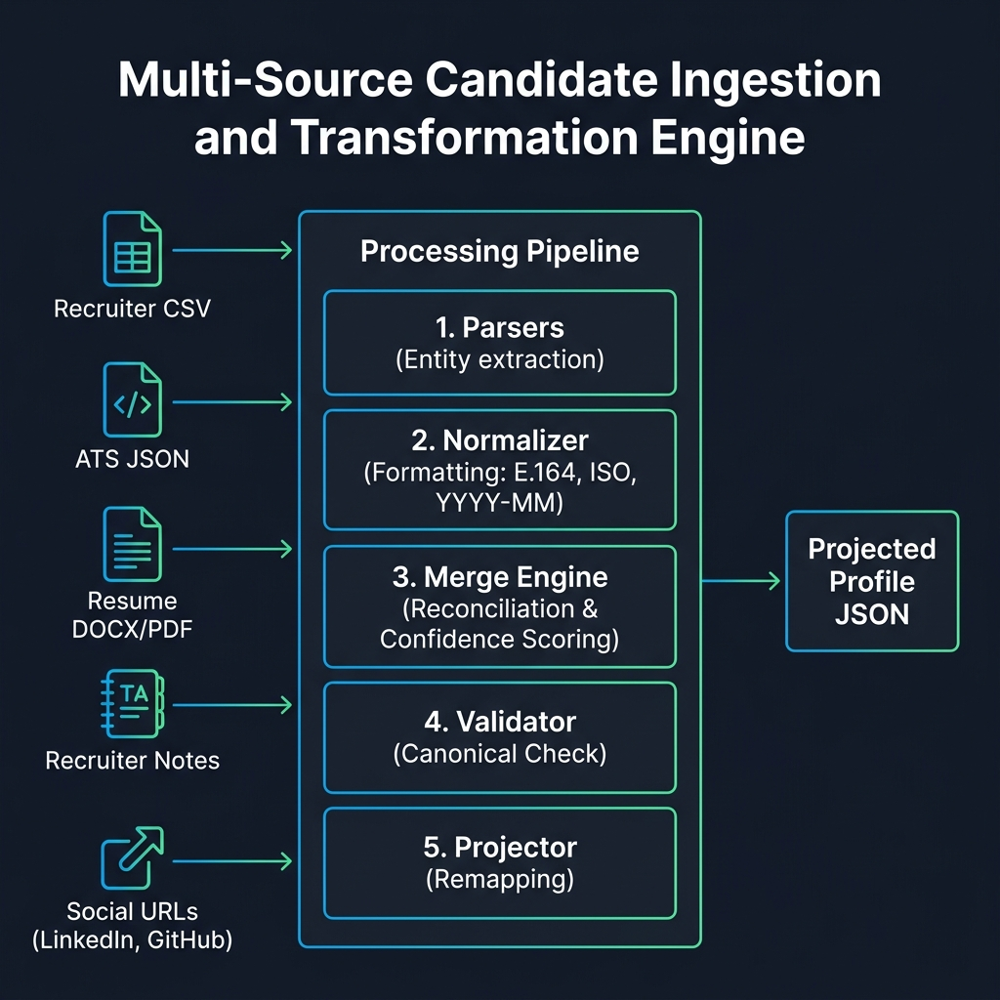
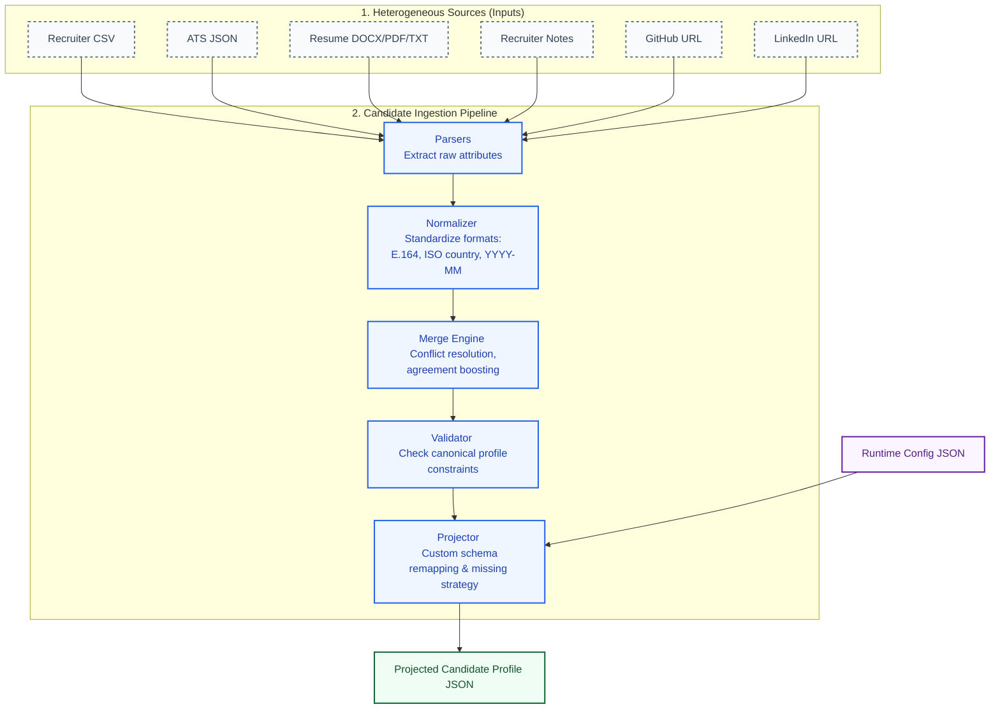

# Multi-Source Candidate Data Transformer

### Eightfold Engineering Intern Assignment

---

## Overview

This project implements a configurable candidate data transformation pipeline that ingests candidate information from multiple heterogeneous sources (such as ATS exports and Resume documents), normalizes formats, validates quality, reconciles conflicting information, and produces a projected candidate profile based on a runtime configuration file.

The engine features robust confidence-based conflict resolution, agreement-based confidence boosting, provenance tracking, and list/index-based custom projection schemas.

---

## Architecture & Processing Flow

The platform utilizes a structured, 5-stage transformation pipeline to clean, reconcile, and reshape candidate profiles. 

### Pipeline Diagram





### Stage-by-Stage Processing Details

| Stage | Component | Core Responsibility | Input Format | Output Format |
| :--- | :--- | :--- | :--- | :--- |
| **1** | **Parsers** | Direct attribute extraction using regex patterns and metadata heuristics. | Heterogeneous files & URLs | Raw, tagged dictionary keys |
| **2** | **Normalizer** | Standardizes names, E.164 phones, ISO-3166-1 country codes, and YYYY-MM date stamps. | Raw parsed inputs | Standardized tagged keys |
| **3** | **Merge Engine** | Resolves conflicts using confidence scores and boosts confidence when sources agree. | Standardized tagged keys | Canonical Candidate Record |
| **4** | **Validator** | Dual-validation layer verifying the profile conforms to the Pydantic schema constraints. | Canonical Record | Confirmed Clean Profile |
| **5** | **Projector** | Reshapes output fields, handles missing values, and renames/remaps paths per runtime config. | Clean Profile + Config | Projected JSON Profile |

#### Key Technical Design Pillars:
* **Explainability**: The output contains a detailed `provenance` log tracking the precise source and normalization method used for every resolved field.
* **Deterministic Behavior**: The system ensures identical input datasets will always yield the identical candidate profiles.
* **State Isolation**: Independent candidate pipelines are fully decoupled. Resets prevent profile data bleeding or contamination.
* **Robust Degradation**: A corrupted or missing data source will not crash the pipeline; the system records missing entries gracefully.

---

## Example Ingestion Mapping

Here is an example of how raw inputs are parsed, merged, and projected:

### Inputs

**1. ATS JSON**
```json
{
  "candidate_name": "Kruthin Reddy",
  "mail": "KRUTHIN@GMAIL.COM",
  "mobile": "9876543210",
  "skills": ["py", "sql", "git"]
}
```

**2. Resume (Unstructured Text)**
```text
PILLIKANDLA KRUTHIN REDDY
kruthinreddy95@gmail.com | +91 9502235163
Skills: Python, Java, MySQL, Git
```

---

### Merged Canonical Record

The merge engine standardizes and unifies fields:
- **Emails**: Combined uniquely `["kruthin@gmail.com", "kruthinreddy95@gmail.com"]`.
- **Skills**: "py" & "Python", "git" & "Git" are normalized and matched. Their confidence is boosted to `1.0` because they were verified by both independent sources.
- **Phones**: Formatted to E.164.

---

### Projected Output (Via Runtime Configuration)

Based on the mapping instructions:
```json
{
  "full_name": "Kruthin Reddy",
  "primary_email": "kruthin@gmail.com",
  "phone": "+919876543210",
  "skills": [
    "Python",
    "Git",
    "SQL",
    "MySQL",
    "Java"
  ],
  "overall_confidence": 0.79
}
```

---

## Assignment Requirements Coverage

| Requirement | Status | Implemented Details |
|:---|:---:|:---|
| **Structured Source** | ✅ | ATS JSON parser with aliases & auto fallback mappings |
| **Unstructured Source** | ✅ | Resume parser (DOCX, PDF, TXT) with regex & heuristics |
| **Data Normalization** | ✅ | E.164 phone normalization, ISO ISO-3166-1 country codes, YYYY-MM dates |
| **Canonical Candidate Profile** | ✅ | Complete schema including Locations, Links, Education, Experience |
| **Provenance Tracking** | ✅ | Tracks source name and reconciliation method per resolved field |
| **Confidence Scoring** | ✅ | Resolves field values by confidence & averages overall confidence |
| **Agreement Boosting** | ✅ | Boosts skill confidences when independent sources agree |
| **Runtime Configuration** | ✅ | Dynamic JSONPath-like projections, type conversions, missing-value strategy |
| **Validation Layer** | ✅ | Canonical quality checks and projected output validation schema |
| **CLI Input/Output Surface**| ✅ | Argparse-based CLI supporting customizable sources and config paths |
| **Unit Tests** | ✅ | Pytest/unittest suite covering all parsing, merging, projecting logic |

---

## Technology Stack

- **Python 3**
- **python-docx** (DOCX structure extraction)
- **pdfplumber** (PDF text extraction)
- **phonenumbers** (E.164 format parsing)
- **pydantic** (Canonical schema model validation)

---

## Project Structure

```text
eightfold-assignment/
├── Eightfold_Design_Document.md    # Detailed system design
├── README.md                       # Execution guide & requirements coverage
├── requirements.txt                # Package dependencies
├── configs/
│   ├── default.json                # Default projection configuration
│   ├── custom.json                 # Custom projection configuration
│   └── settings.json               # Pipeline confidence settings
├── data/
│   ├── ats.json                    # Sample structured ATS data
│   ├── resume.docx                 # Sample unstructured resume
│   ├── recruiter_export.csv        # Sample recruiter CSV export
│   └── recruiter_notes.txt         # Sample recruiter free text notes
├── output/
│   ├── candidate_profile.json      # Output projected profile
│   ├── canonical_profile.json      # Raw intermediate canonical profile
│   └── validation_report.json      # Canonical profile validation status
├── src/
│   ├── main.py                     # CLI entrypoint
│   ├── merger.py                   # Conflict resolution & merge logic
│   ├── projector.py                # JSONPath-like projection & remapping
│   ├── validator.py                # Dual validation rules
│   ├── models/
│   │   └── schema.py               # Pydantic canonical models
│   ├── normalizers/
│   │   └── normalizer.py           # Field normalizations (dates, country, skills, etc.)
│   └── parsers/
│       ├── ats_parser.py           # Structured ATS JSON mapping
│       ├── csv_parser.py           # Recruiter CSV export mapping
│       ├── resume_parser.py        # Text & heuristic Resume entity extractor
│       ├── recruiter_notes_parser.py # Recruiter notes parser
│       ├── github_parser.py        # GitHub API URL fetcher
│       └── linkedin_parser.py      # LinkedIn URL parameter solver
└── tests/                          # Test suite
```

---

## Installation

Install all package dependencies via `requirements.txt`:

```bash
pip install -r requirements.txt
```

---

## Running the Project

Run the pipeline using the default files:

```bash
python3 -m src.main
```

### CLI Arguments

You can customize the input files, configuration, and output location using flags:

```bash
python3 -m src.main --ats data/ats.json --resume data/resume.docx --csv data/recruiter_export.csv --notes data/recruiter_notes.txt --github https://github.com/kruthinreddy95 --linkedin https://linkedin.com/in/pillikandla-kruthin-reddy-b97245289 --config configs/default.json --output output/candidate_profile_all.json
```

- `--ats`: Path to ATS JSON file
- `--resume`: Path to Resume file
- `--csv`: Path to Recruiter CSV export file
- `--notes`: Path to Recruiter notes free text file
- `--github`: GitHub profile URL
- `--linkedin`: LinkedIn profile URL
- `--config`: Path to projection config JSON (default: `configs/default.json`)
- `--output`: Path to save the final projected profile (default: `output/candidate_profile.json`)

### Running the Streamlit Web UI

You can launch a local interactive web interface to upload files, configure projections, visualize confidence metrics, and manage candidates:

```bash
streamlit run app.py
```

#### Streamlit Features:
1. **Interactive Ingestion**: Upload ATS JSON, recruiter CSVs, resume files, and recruiter notes. Auto-pastes links discovered in resumes directly into the URL fields.
2. **State Contamination Protection (State Reset)**:
   - Includes a **`⟳ New Candidate (Reset Inputs)`** action to instantly clear all uploaded files, text inputs, and session configurations.
   - Automatically resets state keys and advances widget indices after running each ingestion pipeline, guaranteeing that data from Candidate A never bleeds into Candidate B's profile.
3. **Talent Pool Database (SQLite)**:
   - Fully persistence-backed candidate database showing aggregate metrics (total counts, average confidence, average experience).
   - View, select, compare, and delete candidates directly from the SQLite store.
   - Bulk download all ingested candidates in projected JSON formats.

### Running with Docker

Build the Docker image:

```bash
docker build -t candidate-transformer .
```

Run the container (runs default files inside the container):

```bash
docker run --rm -v $(pwd)/output:/app/output candidate-transformer
```


---

## Running Tests

To run the unit test suite:

```bash
python3 -m unittest discover -s tests
```

---

## Configuration Schema

The runtime projection config supports:
1. `fields`: An array of items specifying:
   - `path`: The key name in the output profile.
   - `from`: The path in the canonical model (e.g. `emails[0]`, `phones[0]`, `skills[].name`).
   - `type`: Target validator type (`string`, `string[]`, `number`, `object`, `object[]`).
   - `normalize`: Conversion normalizations (`E164`, `canonical`, `upper`, `lower`).
   - `required`: Strict check validation boolean.
2. `include_confidence`: Toggle inclusion of `overall_confidence`.
3. `include_provenance`: Toggle inclusion of the `provenance` log.
4. `on_missing`: Missing field strategy: `"null"`, `"omit"`, or `"error"`.
